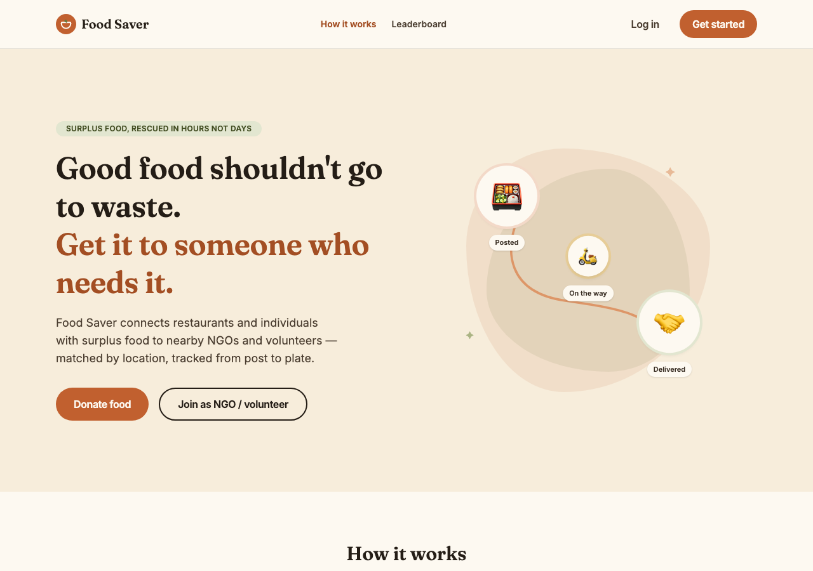
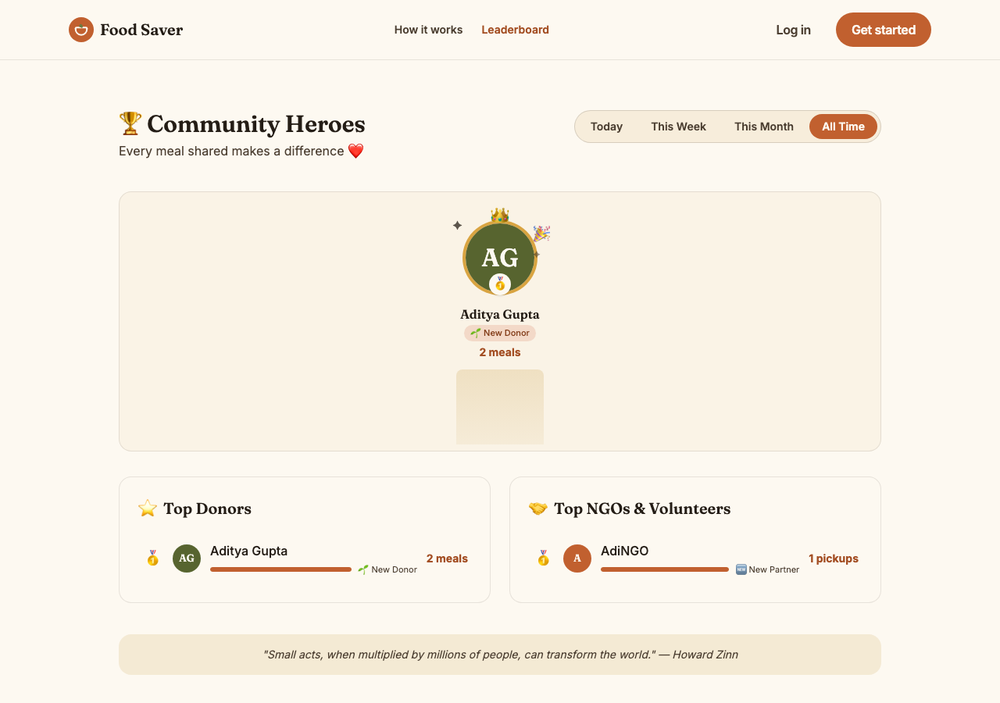
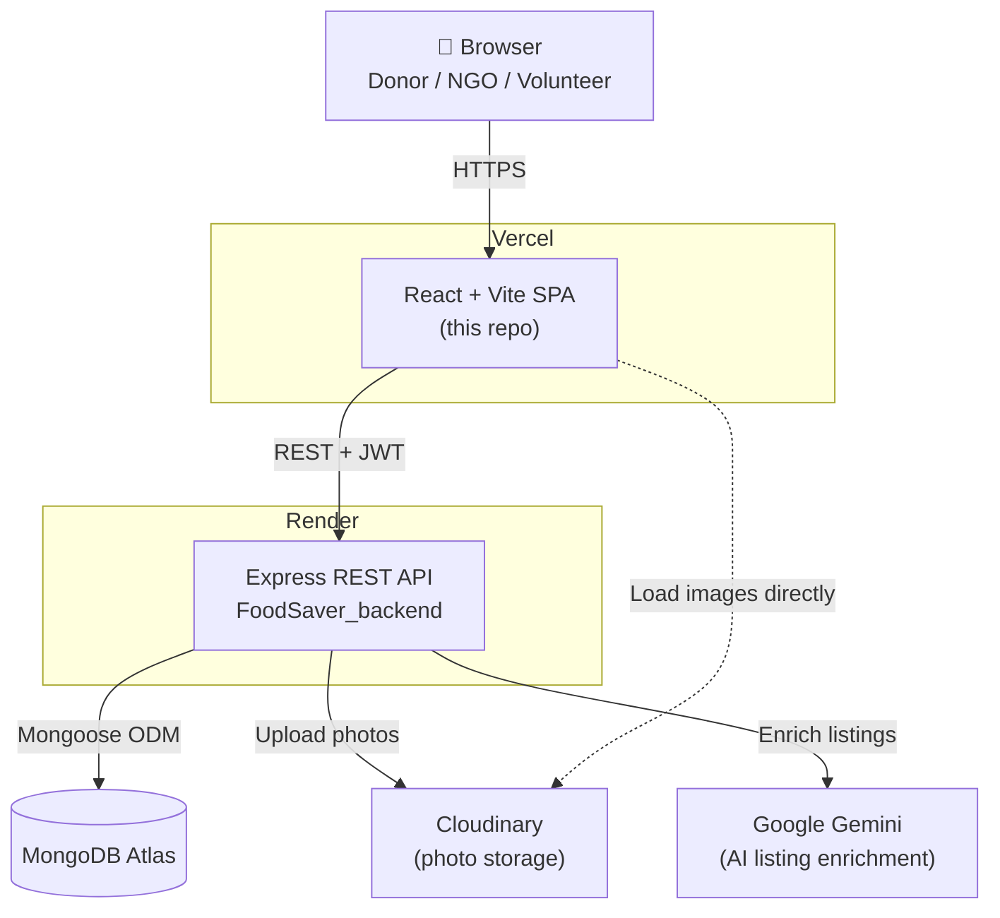
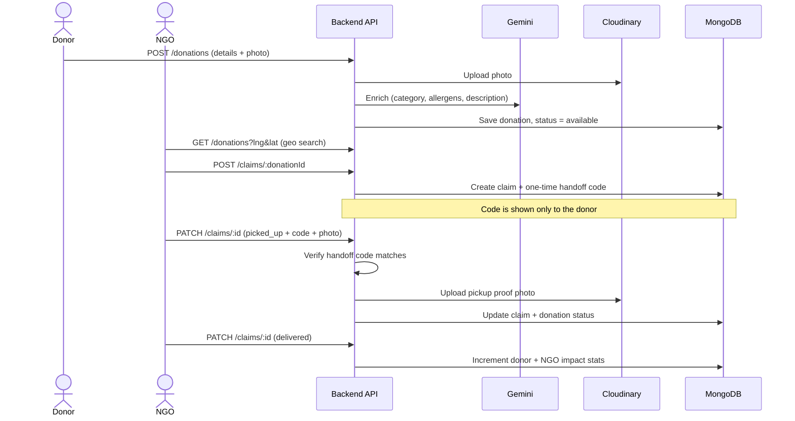

# Food Saver — Frontend

React (Vite) + Tailwind CSS frontend for Food Saver, connecting restaurants and
individuals with surplus food to nearby NGOs and volunteers.

**Live app: https://food-saver-frontend-seven.vercel.app/**

Backend API repo: [`FoodSaver_backend`](https://github.com/Adityaguptawebdev/FoodSaver_backend) — this app talks to it over HTTP and expects it to be running/deployed independently.

<table>
  <tr>
    <td></td>
    <td></td>
  </tr>
</table>

## Stack

- React + React Router
- Tailwind CSS v4
- Framer Motion (storytelling icon animations)
- Recharts (impact charts)
- Axios

## Local setup

```bash
npm install
cp .env.example .env   # set VITE_API_URL to your backend's URL
npm run dev
```

Runs on `http://localhost:5173`. `VITE_API_URL` must point at a running
instance of the backend API (defaults to `http://localhost:5050/api`).

## Deploying (Vercel)

1. Import this repo into Vercel — it auto-detects the Vite build (`npm run
   build`, output directory `dist`).
2. In the Vercel project's **Settings → Environment Variables**, add
   `VITE_API_URL` pointing at your deployed backend, e.g.
   `https://your-backend.onrender.com/api`. This is baked in at build time, so
   redeploy after changing it.
3. On the backend, make sure `CLIENT_ORIGIN` is set to this Vercel deployment's
   URL (no trailing slash — CORS does an exact match) so it allows requests
   from it.

## Pages

- `/` — landing page with live donation feed and platform stats
- `/login`, `/register` — auth (donor / NGO / volunteer roles)
- `/donate`, `/my-donations` — donor flow
- `/browse`, `/my-claims` — NGO/volunteer flow
- `/impact`, `/leaderboard` — impact stats and gamified leaderboard

## Architecture

Food Saver is split into two independently deployed repos — this frontend
(static SPA on Vercel) and the [backend API](https://github.com/Adityaguptawebdev/FoodSaver_backend) (Express on Render) — plus three
managed external services the backend talks to.



### Core flow: post → claim → verified handoff → delivered



See the [backend README](https://github.com/Adityaguptawebdev/FoodSaver_backend#architecture) for the data model (ER diagram) and API surface.
